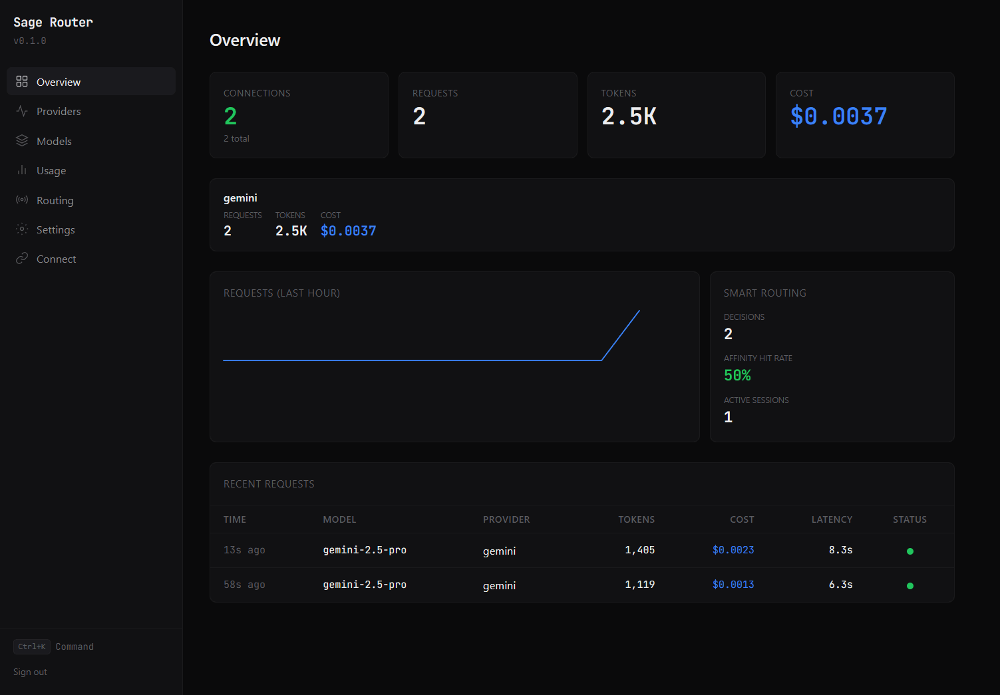

<p align="center">
  <h1 align="center">Sage Router</h1>
  <p align="center">The AI gateway with a brain.</p>
</p>

<p align="center">
  <a href="#quick-start">Quick Start</a> &bull;
  <a href="#how-it-works">How It Works</a> &bull;
  <a href="#connect-your-tools">Connect Your Tools</a> &bull;
  <a href="#dashboard">Dashboard</a> &bull;
  <a href="#api-reference">API</a>
</p>

---

An **intelligent AI routing layer** that picks the right model, handles failures in milliseconds, and preserves context when switching — in a single binary with zero dependencies.

Works with **Claude Code, Cursor, Codex CLI, Cline, Windsurf, Aider** — anything that speaks OpenAI.

```
Your Tools                    Sage Router                     Providers
┌────────────┐              ┌──────────────┐              ┌──────────────┐
│ Claude Code │──┐          │  Translate   │          ┌──▸│  Anthropic   │
│ Cursor      │──┤  OpenAI  │  Route       │  Native  │   │  (Claude)    │
│ Codex CLI   │──┼─ format ─▸  Select      ├─ format ─┤   ├──────────────┤
│ Cline       │──┤          │  Retry       │          ├──▸│  Google      │
│ Aider       │──┘          │  Track       │          │   │  (Gemini)    │
└────────────┘              └──────────────┘          │   ├──────────────┤
                                                      └──▸│  OpenAI      │
                                                          └──────────────┘
```

## What Makes Sage Router Different

### Ultrafast. Ultralight. Zero overhead.

Sage Router is written in Go and compiled to a single static binary. No runtime, no interpreter, no garbage collection pauses. It adds **<2ms of latency** to your requests — the bottleneck is always the upstream provider, never the router.

| Metric | Value |
|--------|-------|
| Binary size | ~15 MB |
| Memory at idle | ~12 MB |
| Memory under load | ~30 MB |
| Added latency | <2ms P99 |
| Startup time | <100ms |
| Dependencies | **Zero** |

This is HAProxy-class efficiency for AI routing. No Python. No Redis. No Postgres. No Docker required. Download, run, done.

### Smart Routing That Thinks For You

Most gateways do round-robin and call it "load balancing." Sage Router actually understands your intent:

**Pick a strategy, or let Sage Router decide:**

| Strategy | What it does | When to use |
|----------|-------------|-------------|
| `cost` | Routes to the cheapest capable model first | Bulk work, background tasks |
| `performance` | Routes to the fastest model first | Interactive coding, real-time pairing |
| `balanced` | Weighs cost vs. speed vs. quality | General-purpose — the default |
| `fallback` | Strict priority chain, fail over sequentially | When you have a preferred model |

**It gets smarter over time:**
- **Session affinity** — keeps a conversation on the same model so context quality stays high
- **Hard constraint filtering** — won't route a vision request to a text-only model, won't send 200K tokens to a 128K model
- **Auto-recovery** — background health checker monitors every connection, restores errored ones after grace periods
- **Per-model rate limit tracking** — a 429 on Sonnet doesn't block Haiku on the same account

You configure the *outcome you want*. Sage Router figures out the *how*.

### Context Bridge — Never Lose Your Train of Thought

**This is the feature no other gateway has.**

When Sage Router switches models mid-conversation (rate limit, fallback, strategy change), the new model doesn't know what happened before. Other gateways just forward the raw conversation and hope for the best.

Sage Router generates a **context bridge** — a structured state snapshot injected as a system message:

```
[Context Bridge — model switch from claude-sonnet-4 to gemini-2.5-pro]

Active files: src/server.go, internal/auth/manager.go
Key decisions: Using JWT for dashboard auth, HMAC for API keys
Current task: Implementing rate-limited login with per-IP tracking
Last action: Added middleware in server.go:142, test failing on line 89
```

The new model picks up exactly where the old one left off. No repeated explanations. No lost context. No "as an AI, I don't have context about your previous conversation."

**What's coming next:** LLM-compressed bridges that distill entire conversations into dense, high-signal summaries — not just file paths and decisions, but understanding.

---

## Why Sage Router?

| Problem | Without Sage Router | With Sage Router |
|---------|-------------------|-----------------|
| Rate limited on Claude | Wait, or manually switch models | Auto-fallback to Gemini in <100ms |
| Multiple AI accounts | Juggle API keys per tool | One `sk-sage-*` key, rotation handled |
| Track spending | Check each provider dashboard | Unified cost tracking across all providers |
| Try a new provider | Reconfigure every tool | Add connection in dashboard, done |
| Claude Code + Gemini | Pick one | Use both — Claude for complex tasks, Gemini for speed |
| Model switch loses context | Start over, re-explain everything | Context bridge preserves state automatically |

## Quick Start

```bash
# Option 1: Install script (Linux/macOS)
curl -fsSL https://sage-router.dev/install.sh | sh

# Option 2: Docker
docker run -p 20128:20128 -v sage-data:/home/sage/.sage-router ghcr.io/sage-router/sage-router

# Option 3: Build from source
git clone https://github.com/sage-router/sage-router && cd sage-router
make build
./bin/sage-router
```

On first run, Sage Router prints a one-click setup URL:

```
  ┌─────────────────────────────────────────────────────┐
  │                                                     │
  │   Sage Router v0.1.0                                │
  │                                                     │
  │   Dashboard:  http://127.0.0.1:20128/dashboard      │
  │   API:        http://127.0.0.1:20128/v1             │
  │                                                     │
  │   First-run setup:                                  │
  │   http://127.0.0.1:20128/dashboard/?token=Kx7mP2    │
  │                                                     │
  └─────────────────────────────────────────────────────┘
```

Click the link → create a password → you're in.



**Auto-detect:** If you already use Claude Code, Sage Router finds your credentials automatically. No copy-pasting API keys.

## How It Works

Every request flows through an **8-stage pipeline**:

```
Ingress → Auth → Resolve → Select → Translate → Execute → Stream → Track
```

All providers speak different protocols (OpenAI, Claude Messages, Gemini), but the problems are the same. Sage Router translates everything to a **canonical format**, routes intelligently, then translates back.

### Combo Models

Define fallback chains that span providers:

```
"fast-and-reliable": claude-sonnet-4 → gemini-2.5-flash → gpt-4o-mini
```

Request goes to Claude first. Rate limited? Gemini picks up in <100ms. Gemini down? OpenAI catches it. Your tools never see an error.

### Format Translation

Real-time, bidirectional protocol translation:

| From | To | What's translated |
|------|-----|-------------------|
| OpenAI `chat.completions` | Claude `messages` | Messages, tools, images, system prompts, streaming |
| OpenAI `chat.completions` | Gemini `generateContent` | Messages, tools, function calls, streaming |
| Claude `messages` | OpenAI `chat.completions` | Thinking blocks, tool use, images, streaming |

Including SSE stream translation — Claude's `content_block_delta` events become OpenAI's `chat.completion.chunk` events in real-time.

### Prompt Cache Optimization

Sage Router automatically injects cache control hints for providers that support prompt caching (Anthropic, Google). Long system prompts and conversation history get cached, reducing costs by up to 90% on repeated requests.

## Connect Your Tools

Once Sage Router is running, point any OpenAI-compatible tool at it:

### Claude Code
```bash
export ANTHROPIC_BASE_URL="http://127.0.0.1:20128"
export ANTHROPIC_API_KEY="sk-sage-YOUR-KEY"
claude
```

### Codex CLI
```bash
export OPENAI_BASE_URL="http://127.0.0.1:20128/v1"
export OPENAI_API_KEY="sk-sage-YOUR-KEY"
codex
```

### Cursor
Settings → Models → Override OpenAI Base URL → `http://127.0.0.1:20128/v1`

### Cline
Settings → API Provider → OpenAI Compatible → Base URL: `http://127.0.0.1:20128/v1`

### Aider
```bash
export OPENAI_API_BASE="http://127.0.0.1:20128/v1"
export OPENAI_API_KEY="sk-sage-YOUR-KEY"
aider
```

## Dashboard

Sage Router includes a built-in web dashboard for:

- **Overview** — system health, active connections, request stats, cost tracking
- **Providers** — add/remove connections, test connectivity, auto-detect credentials
- **Models** — browse available models across all providers, create aliases and combos
- **Usage** — request history, token counts, cost breakdown by model and provider
- **Routing** — view routing decisions, affinity hits, strategy effectiveness
- **Connect** — generate API keys, get copy-paste instructions for every supported tool

## Supported Providers

| Provider | Format | Auth | Models |
|----------|--------|------|--------|
| **Anthropic** | Claude Messages | API key, OAuth (auto-detect) | Claude Opus, Sonnet, Haiku |
| **Google** | Gemini | API key | Gemini 2.5 Pro, Flash |
| **OpenAI** | OpenAI | API key, OAuth | GPT-4o, GPT-4o-mini, o3, o4-mini |
| **GitHub Copilot** | OpenAI | OAuth token | GPT-4o, Claude (via Copilot) |
| **OpenRouter** | OpenAI | API key | 100+ models |
| **Ollama** | OpenAI | None | Any local model |

Adding a new provider is O(1) work — write a translator, register it.

## Security

- **Encrypted storage** — AES-256-GCM encryption at rest for all credentials
- **HMAC-signed API keys** — `sk-sage-*` keys are signed, not stored in plaintext
- **Dashboard auth** — password-protected with JWT sessions
- **One-time setup tokens** — first-run URL expires after use
- **Local-only by default** — binds to `127.0.0.1`, not `0.0.0.0`

## API Reference

### Proxy Endpoints

| Method | Path | Description |
|--------|------|-------------|
| `POST` | `/v1/chat/completions` | OpenAI-compatible chat completions |
| `POST` | `/v1/messages` | Claude-compatible messages |
| `GET` | `/v1/models` | List available models |

### Management API

| Method | Path | Description |
|--------|------|-------------|
| `GET/POST` | `/api/connections` | Manage provider connections |
| `GET/POST` | `/api/combos` | Manage combo models |
| `GET/POST` | `/api/aliases` | Manage model aliases |
| `GET/POST/DELETE` | `/api/keys` | Manage API keys |
| `GET` | `/api/models` | Full model catalog |
| `GET` | `/api/usage` | Usage history and costs |
| `GET` | `/api/routing/summary` | Routing decision stats |
| `GET` | `/api/status` | System status and health |

## Development

```bash
# Prerequisites: Go 1.22+, Node.js 22+

# Build everything (dashboard + binary)
make build

# Run in dev mode
make dev

# Run tests (92+ tests across 11 packages)
make test

# Cross-compile for all platforms
make release

# Build Docker image
make docker
```

## License

MIT
